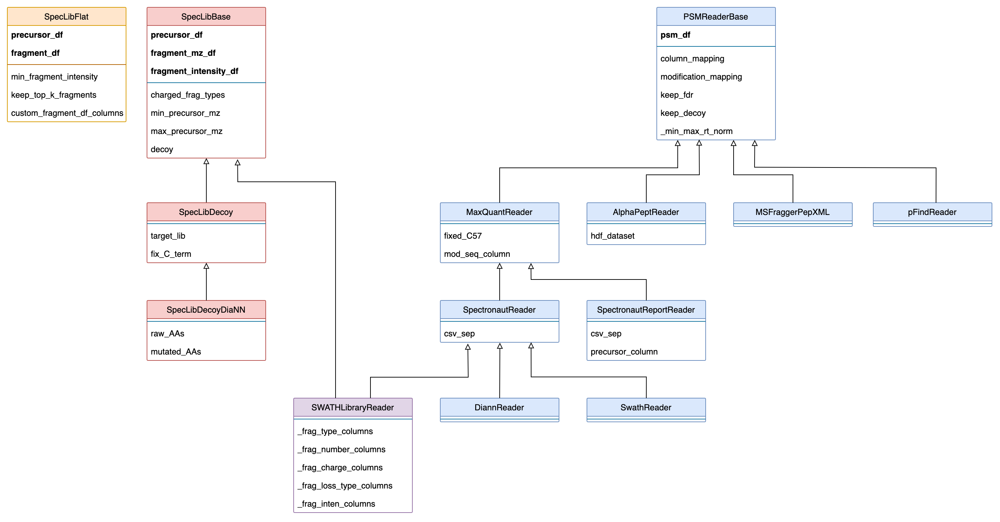

About AlphaBase
====================

AlphaBase is the core package of the AlphaX proteomics ecosystem and provides a common pandas interface for working with proteomics data.
It is used internally in a number of AlphaX packages but can also be used for the development of new proteomics tools.

The main goals of the package are:

    - to provide a common data structure for proteins, peptides and their fragments
    - to read and write data from common proteomics file formats
    - to allow the user to manipulate the data in a simple and intuitive way

AlphaBase is written in Python and is compatible with Python 3.8+ and actively used in **AlphaPeptDeep**, **AlphaPept** and **AlphaDIA**.

Features
-----------

Peptide Spectrum Matches (PSMs)
^^^^^^^^^^^^^^^^^^^^^^^^^^^^^^^^^^^^

AlphaBase can be used to read result tables from a number of common proteomics tools. The input tab or comma separated files are imported and parsed based on individual column definitions. Modifications and modified sequences are parsed and converted to a common format. The common format can be saved and loaded as space saving hdf5 binary file.
The following formats are supported:

============ ======= =============================================================== 
Name         Status  Comment
============ ======= =============================================================== 
MaxQuant      ✅      MaxQuant evidence.txt result table
Alphapept     ✅      Alphapept result table
MSFragger     ✅      MSFragger result table
pFind         ✅      pFind reader
Spectronaut   ✅      Spectronaut results as well as Spectronaut reports
DIA-NN        ✅      DIA-NN result table
SWATH-MS      ✅      Open SWATH result table
============ ======= ===============================================================

Spectral Libraries
^^^^^^^^^^^^^^^^^^^^^^^^^^^^^^^^^^^^

Alphabase can be used to load and modify spectral libraries. Fasta files can be in-silico digested based on custom defined rules and modifications can be managed. All relevant attributes including precursor and fragment masses or isotopic distributions can be calculated. Spectral libraries can be further improved by predicting retention times, ion mobility values and fragment intensities using AlphaPeptDeep.
Readers for the follwing input formats have been implemented:

============ ======= ===============================================================
Name         Status  Comment
============ ======= ===============================================================
MSFragger    ✅       MSFragger spectral library
DIA-NN       ⚙️        DIA-NN .tsv spectral libraries
============ ======= ===============================================================

Package Structure
^^^^^^^^^^^^^^^^^^^^^^^^^^^^^^^^^^^^

